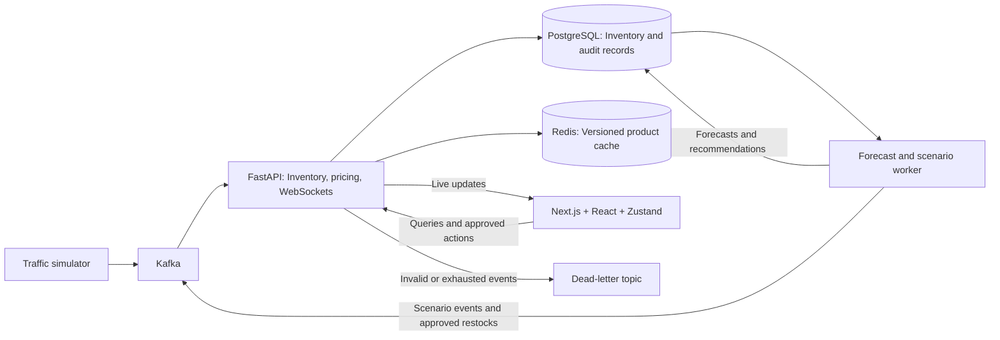

# FlashFlow

**Real-time retail operations, explainable forecasting, and measurable event processing.**

FlashFlow helps an operator follow changing inventory, identify stockout risk, understand replenishment advice, and approve restocks with a durable audit trail. It combines a Kafka-backed inventory pipeline with a live dashboard, demand forecasts, and an evidence-grounded Analyst.

## The problem

During a flash sale, demand and inventory can change faster than an operator can interpret—or a browser can efficiently render. A useful system must keep inventory correct through retries and outages, deliver fresh updates without overwhelming the interface, and turn those updates into decisions that can be explained and traced.

FlashFlow explores that problem end to end using simulated retail traffic and repeatable demand scenarios.

## What you can do

- **Monitor operations:** see live inventory, audited price changes, stockout risk, and products needing attention.
- **Investigate a product:** compare current inventory with its forecast snapshot, prediction range, sales history, and pricing evidence.
- **Review replenishment:** inspect the original calculation, approve or reject advice, and trace an approved restock through Kafka to execution.
- **Ask the Analyst:** get readable answers about product risk, scenarios, and system health, with expandable source evidence. The default mode is deterministic and requires no LLM API key.
- **Inspect the engineering:** compare four rendering modes and examine pipeline timings, partition lag, retries, errors, and dead-letter records.

## Architecture



Inventory processing, rule-based pricing, and WebSocket delivery share one API process. Forecasting and scenario execution run in an independent worker. PostgreSQL is the durable source of truth; Redis accelerates product reads.

## Engineering highlights

- **Correctness under replay:** product-keyed Kafka ordering, version checks, transactional event receipts, row locks, and manual offset commits prevent duplicate inventory changes. Bounded transaction batches reduce database overhead.
- **Recovery and backpressure:** retries, dead-letter handling, circuit recovery, bounded WebSocket queues, heartbeats, and snapshot reconciliation handle failures and slow clients.
- **Efficient rendering:** normalized Zustand state, product-level subscriptions, memoized cards, and animation-frame batching keep ingestion separate from rendering. The Engineering view compares NAIVE, ATOMIC, MEMOIZED, and BATCHED modes.
- **Explainable decisions:** a trained demand model with a moving-average fallback produces advisory forecasts and prediction bands. Recommendations retain their source snapshot, suppress unchanged advice, and require approval before execution. Pricing remains rule-based.
- **Measured behavior:** stage percentiles, clock-aware browser timings, live integration probes, and repeatable pipeline/rendering benchmarks expose bottlenecks and measurement limits.

## Run locally

Requires Docker Desktop with Compose. Copy `.env.example` to `.env` and configure these values for interactive scenarios and approvals:

```dotenv
APP_ENV=development
ENABLE_RETAIL_CONTROLS=true
CHAOS_TOKEN=<your-local-random-token>
ENABLE_CHAOS=false
ANALYST_ENABLED=false
```

Then start the stack:

```bash
docker compose up -d --build --wait
```

Open the [dashboard](http://localhost:3000), [Engineering view](http://localhost:3000/engineering), or [API documentation](http://localhost:8000/docs).

Choose a **Retail Demo** product and start **Flash Sale**. Allow the normal-demand warm-up, watch sales and inventory change, inspect a fresh recommendation, and approve replenishment. Five real seconds represent five simulated minutes. The local token stays behind the frontend proxy; it is a development guard rather than application authentication.

## Validation and scope

The latest local validation passed **46 backend, 15 frontend, and 13 browser tests**, plus live Kafka and recovery probes. A one-minute pipeline run produced **499.8 events/sec** and completed **483.4/sec including drain**, with zero failed-processing or DLQ increments. Separate synthetic BATCHED rendering trials measured **59.25–59.55 FPS**. [Results and reproduction details](docs/final-polish.md) distinguish socket delivery from rendered latency.

All retail data is simulated and forecasts are advisory. Live forecasting error can be substantially higher than offline test error. The deployment uses one API gateway; authentication, multi-host fanout, and production capacity validation remain outside its current scope.

## Further reading

- [Retail implementation and measured results](docs/ai-retail-report.md)
- [Forecasting experiment](docs/ml-experiment.md)
- [Pipeline performance and methodology](docs/throughput-report.md)
- [Validation and demo reproduction](docs/final-polish.md)
