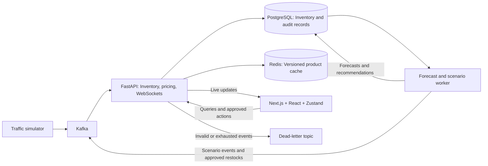

# FlashFlow

**A real-time, event-driven retail operations platform engineered for flash-sale traffic — with demand forecasting, stockout intelligence, fault tolerance, and measurable end-to-end performance.**

FlashFlow simulates the engineering challenges behind a high-traffic retail system where hundreds of inventory events can arrive every second while operators still need **correct inventory, fresh decisions, and a responsive dashboard**.

Instead of treating this as only a frontend streaming problem, FlashFlow handles the complete path:

**event ingestion → ordered processing → durable state → cache synchronization → live fanout → render optimization → demand forecasting → stockout detection → human-approved action.**

The system uses **Apache Kafka, FastAPI, PostgreSQL, Redis, WebSockets, Next.js/React, Zustand, and ML forecasting**, with instrumentation across the pipeline to measure where latency and bottlenecks actually occur.

> All retail traffic and demand data are simulated. Forecasts are advisory, consequential actions require human approval, and local benchmarks are not production-capacity claims.

---

## The Engineering Challenge

A flash sale creates a deceptively difficult systems problem.

Imagine hundreds or thousands of customers interacting with products at the same time:

```text
Purchase
Purchase
Reservation
Purchase
Price update
Reservation
Restock
Purchase
...
```

Those events may arrive faster than a database should be updated individually and much faster than a browser should rerender.

Simply sending every event directly to the UI creates several problems.

### Backend pressure

A sudden burst can create:

- high event-ingestion rates
- database transaction overhead
- growing Kafka consumer lag
- duplicate delivery after retries
- stale events overwriting newer inventory
- downstream services becoming slower than producers

### Real-time delivery pressure

Even if the backend processes events correctly:

```text
Kafka → Backend → WebSocket → Browser
```

a slow browser or WebSocket client must not block the inventory pipeline or other connected clients.

### Frontend pressure

If every WebSocket event immediately triggers a React state update:

```text
500 events/sec
      ↓
500 state updates/sec
      ↓
potentially hundreds of unnecessary renders
```

the browser can become the bottleneck even when Kafka and the backend are healthy.

### Operational pressure

Showing rapidly changing numbers is also not enough.

An operator needs to know:

> Which products are actually in danger?

> Are they likely to run out soon?

> Why did the price change?

> Should inventory be replenished?

> What happened during the flash sale?

So FlashFlow treats the problem as both a **distributed-systems problem** and a **real-time decision-support problem**.

---

## How FlashFlow Solves It

FlashFlow separates the system into independent responsibilities instead of allowing every incoming event to propagate directly into expensive work.

```text
High-frequency retail traffic
              ↓
           Kafka
              ↓
     Ordered consumers
              ↓
   Batched transactional work
              ↓
      PostgreSQL + Redis
              ↓
       WebSocket fanout
              ↓
      Browser event buffer
              ↓
 requestAnimationFrame batching
              ↓
      Product-level updates
```

On top of that operational pipeline:

```text
Historical retail activity
              ↓
       Feature generation
              ↓
       Demand forecast
              ↓
        Prediction band
              ↓
        Stockout risk
              ↓
 Replenishment recommendation
              ↓
        Human approval
              ↓
            Kafka
              ↓
       Inventory update
```

This keeps **transactional correctness, ML inference, operator decisions, and frontend rendering separated**.

A forecasting failure cannot corrupt inventory.

A slow browser cannot stop Kafka consumption.

A duplicate Kafka event cannot decrement stock twice.

And an ML recommendation cannot silently modify inventory without operator approval.

---

## Architecture



Inventory processing, rule-based pricing, and WebSocket delivery share one API process. Forecasting and scenario execution run in an independent worker. PostgreSQL is the durable source of truth; Redis accelerates product reads.

---

# Engineering the Event Pipeline

## 1. Kafka absorbs bursty traffic

The simulator does not directly update the database or frontend.

It publishes inventory events to Kafka.

```text
Simulator
    ↓
inventory-events
    ↓
Kafka partitions
    ↓
Consumer group
```

Events are keyed using `product_id`.

This provides two useful properties:

- events for the same product remain ordered within their partition
- different products can be processed concurrently across partitions

Kafka therefore acts as both the event backbone and a buffer between traffic generation and processing capacity.

---

## 2. Inventory processing is replay-safe

Kafka provides at-least-once delivery behavior, so consumers must assume an event can appear more than once.

Every event contains a stable `event_id`.

FlashFlow records processed events transactionally and checks them before applying another mutation.

```text
Kafka event
    ↓
Validate
    ↓
Check event_id
    ↓
Check product version
    ↓
Lock product state
    ↓
Apply inventory mutation
    ↓
Persist event receipt
    ↓
Commit transaction
    ↓
Commit Kafka offset
```

This protects several important invariants:

- duplicate delivery cannot decrement inventory twice
- stale versions cannot overwrite newer state
- stock cannot become negative
- offsets are not considered complete before processing reaches a safe state

Invalid or exhausted events can be routed to a dead-letter topic rather than silently disappearing.

---

## 3. Database work is batched

An early implementation effectively paid database transaction overhead too frequently during heavy traffic.

The consumer pipeline therefore uses bounded transactional batches.

Conceptually:

```text
Before

Event
 ↓
DB transaction

Event
 ↓
DB transaction

Event
 ↓
DB transaction
```

versus:

```text
After

Event ┐
Event ├── bounded batch
Event ┘
       ↓
PostgreSQL transaction
       ↓
Grouped completion / offset work
```

The goal is not to maximize batch size indefinitely.

Large batches improve throughput but can increase waiting time.

FlashFlow therefore exposes queue, processing, database, batch and commit percentiles so the trade-off can be measured rather than guessed.

---

## 4. PostgreSQL and Redis have different responsibilities

FlashFlow does not treat Redis as the source of truth.

### PostgreSQL

Stores durable state such as:

- product inventory
- processed-event receipts
- pricing decisions
- forecasts
- recommendations
- operator actions
- audit history

### Redis

Provides:

- fast product snapshots
- versioned cache state
- degraded-mode fallback

The normal relationship is:

```text
Kafka
  ↓
Consumer
  ↓
PostgreSQL
  ↓
Redis
  ↓
WebSocket
```

If the primary inventory read path becomes unavailable, the circuit breaker can expose the most recent Redis snapshot while the frontend clearly marks the state as stale.

---

# Keeping the Browser Fast

One of FlashFlow's central experiments is that:

> **event ingestion rate should not equal render rate.**

A naive real-time React implementation might do this:

```text
WebSocket event
      ↓
setState()
      ↓
React render

WebSocket event
      ↓
setState()
      ↓
React render
```

At high update rates, that creates unnecessary rendering pressure.

FlashFlow instead uses:

```text
WebSocket
     ↓
Incoming event buffer
     ↓
Merge latest update per product
     ↓
requestAnimationFrame
     ↓
Single Zustand transaction
     ↓
Product-specific subscription
     ↓
Memoized product card
```

If five updates for the same product arrive before the next useful flush, the UI does not need to visually render all five intermediate states.

It needs the newest valid state.

This allows the network pipeline to ingest updates independently from the browser's rendering lifecycle.

---

## Rendering Modes

The Engineering dashboard makes this optimization directly comparable.

| Mode | State subscription | Card rendering | Event handling |
|---|---|---|---|
| `NAIVE` | Whole product map | Broad rerenders | Immediate |
| `ATOMIC` | Product-level selector | Unmemoized | Immediate |
| `MEMOIZED` | Product-level selector | Memoized | Immediate |
| `BATCHED` | Product-level selector | Memoized | Frame-batched |

The goal is not simply to claim that batching is faster.

FlashFlow measures:

- socket events/sec
- UI flushes/sec
- events per flush
- card commits/sec
- estimated FPS
- browser queue latency
- flush-to-commit latency
- clock-aligned event-to-screen latency

---

# From Real-Time Data to Retail Decisions

A technically healthy streaming system still leaves an important question:

> **What should the operator actually do with all this data?**

FlashFlow adds a decision-intelligence layer on top of the event pipeline.

---

## Demand Forecasting

The forecast worker consumes historical operational data and predicts demand over the next simulated hour.

The forecasting pipeline uses:

- lagged sales features
- rolling demand features
- time features
- price information
- scenario context
- a trained gradient-boosting model
- a moving-average fallback

The system produces:

```text
Expected demand
        +
Prediction range
        +
Forecast timestamp
        +
Inventory snapshot
        +
Model version
```

For example:

```text
Current inventory
36 units

Inventory when forecast was generated
38 units

Expected next-hour demand
24 units

Likely range
18–30 units
```

The distinction between **current inventory** and **forecast-time inventory** is intentional.

FlashFlow is a live system, so inventory may continue changing after a forecast is produced.

---

## Stockout Risk

Forecasts become operationally useful when compared with available inventory.

```text
Available inventory
        +
Expected demand
        +
Prediction upper bound
        +
Recent demand
        ↓
Stockout assessment
```

Products are surfaced as:

```text
HEALTHY
MEDIUM
HIGH
CRITICAL
```

High-risk products automatically move into **Needs Attention** on the Operations dashboard.

---

## Explainable Replenishment

When inventory is insufficient relative to predicted demand and configured safety stock, FlashFlow can create a replenishment recommendation.

A recommendation preserves:

- forecast used
- inventory snapshot
- prediction range
- safety-stock target
- recommended quantity
- reason
- risk level
- lifecycle status
- timestamps

Similar recommendations are suppressed using material-change thresholds and cooldown rules so rapidly refreshing forecasts do not generate recommendation spam.

The exact calculation remains available for inspection.

---

## Human-in-the-Loop Execution

The ML system is advisory.

It cannot directly modify inventory.

```text
Forecast
    ↓
Stockout risk
    ↓
Restock recommendation
    ↓
Operator
 ┌───────┴────────┐
 ↓                ↓
Approve          Reject
 ↓
Kafka restock event
 ↓
Normal inventory pipeline
 ↓
Updated stock
 ↓
Updated risk
```

This means an approved restock follows the **same event architecture as every other inventory mutation**.

The frontend never fakes the result.

---

# Evidence-Grounded Analyst

FlashFlow includes an Analyst for investigating the system using natural questions such as:

> Which products need attention?

> Why is this product high risk?

> Why did its price change?

> What happened during the flash sale?

> Which recommendations are pending?

> Is the system healthy?

The default Analyst intentionally does **not require an LLM API key**.

Instead:

```text
Question
   ↓
Intent selection
   ↓
Narrow backend tools
   ↓
Verified structured evidence
   ↓
Deterministic explanation
```

Responses include readable summaries, timestamps and expandable source evidence.

The Analyst does not become a source of truth.

Authoritative calculations remain in the backend.

---

# Dynamic Pricing

Pricing is intentionally rule-based rather than delegated to an LLM.

The pricing engine considers signals including:

- recent sales velocity
- reservation pressure
- available-stock ratio
- current/base price
- cooldown
- previous adjustment direction
- configured price limits

Every decision records:

```text
Previous price
Recommended price
Applied price
Adjustment
Input signals
Decision reason
Timestamp
Outcome
```

This keeps pricing explainable and auditable.

---

# Fault Tolerance and Recovery

Real-time systems should continue behaving predictably when individual components fail.

FlashFlow includes:

- retries
- dead-letter handling
- duplicate protection
- stale-version protection
- circuit breaker
- Redis fallback
- bounded WebSocket queues
- heartbeat/liveness detection
- reconnect with backoff
- snapshot reconciliation
- graceful shutdown

The frontend exposes explicit connection states:

```text
CONNECTING
     ↓
LIVE
     ↓ failure
RECONNECTING
     ↓
DEGRADED
     ↓ recovery
LIVE
```

If live reads fail but cached data exists, the dashboard does not silently pretend that the data is current.

It displays the cached snapshot together with its age.

---

# Failure Isolation

A key design goal is preventing one subsystem from taking down unrelated functionality.

```text
                    ┌── Forecasting
                    │
Kafka → Inventory ──┼── Pricing
                    │
                    └── WebSocket updates
```

Therefore:

- forecasting failure does not stop inventory processing
- Analyst failure does not stop forecasting
- a slow WebSocket client does not stop Kafka consumption
- Redis failure does not replace PostgreSQL as durable truth
- malformed events do not silently corrupt inventory
- an unapproved ML recommendation cannot modify stock

---

# Observability

FlashFlow instruments the pipeline stage by stage:

```text
Producer
   ↓
Kafka broker
   ↓
Consumer queue
   ↓
Processing
   ├── PostgreSQL
   ├── Redis
   ├── Pricing
   └── Offset commit
   ↓
WebSocket queue
   ↓
Socket send
   ↓
Browser receipt
   ↓
UI batch
   ↓
React commit
```

The Engineering dashboard exposes metrics including:

- broker ingress
- consumed/completed records
- committed consumer lag
- per-partition lag
- producer → broker P50/P95/P99
- broker → consumer P50/P95/P99
- queue wait P50/P95/P99
- database P50/P95/P99
- Redis P50/P95/P99
- processing P50/P95/P99
- offset commit P50/P95/P99
- WebSocket queue/send latency
- browser queue latency
- flush → React commit latency
- FPS
- duplicates
- failed attempts
- DLQ count

Cross-process event latency uses clock-offset estimation rather than assuming browser and server clocks are perfectly synchronized.

---

# Measured Performance

FlashFlow includes repeatable local benchmarks instead of relying on theoretical throughput claims.

## Backend Pipeline

A final one-minute local pipeline run produced:

| Metric | Result |
|---|---:|
| Target rate | **500 events/sec** |
| Generated events | **29,991** |
| Producer throughput | **499.8 events/sec** |
| Completed throughput including drain | **483.4 events/sec** |
| Final committed Kafka lag | **0** |
| Processing failure increments | **0** |
| DLQ increments | **0** |

The important result is not merely reaching 500 events/sec.

The system also **drained the backlog completely**, rather than reporting producer throughput while leaving unprocessed Kafka records behind.

---

## Frontend Rendering

Separate synthetic `BATCHED` rendering trials at approximately 500 updates/sec measured:

| Metric | Result |
|---|---:|
| Estimated FPS | **59.25–59.55 FPS** |
| Synthetic update rate | **~500 updates/sec** |

The optimized architecture keeps network ingestion separate from React rendering using product-level subscriptions, memoization and frame batching.

Detailed methodology is documented in [`docs/final-polish.md`](docs/final-polish.md).

---

# Validation

The latest local validation passed:

- **46 backend tests**
- **15 frontend tests**
- **13 browser tests**
- live Kafka integration probes
- inventory processing checks
- pricing checks
- recovery/fallback checks

The test suite covers areas including:

- duplicate events
- stale versions
- inventory invariants
- recommendation lifecycle
- forecast snapshots
- Analyst grounding
- scenario determinism
- reconnect behavior
- fallback behavior
- rendering behavior

---

# End-to-End Demo

The strongest FlashFlow demonstration is not a static dashboard.

It is a complete system reaction.

```text
1. Start Flash Sale
        ↓
2. Demand increases
        ↓
3. Kafka receives inventory events
        ↓
4. Inventory falls
        ↓
5. Forecast reacts
        ↓
6. Stockout risk rises
        ↓
7. Product enters Needs Attention
        ↓
8. Recommendation is generated
        ↓
9. Operator inspects explanation
        ↓
10. Operator approves
        ↓
11. Restock is published through Kafka
        ↓
12. Inventory consumer applies it
        ↓
13. Stock increases
        ↓
14. Risk decreases
        ↓
15. Action remains in audit history
```

The demo scenario is deterministic and uses the real event pipeline rather than frontend-only state changes.

Five real seconds represent five simulated minutes in the retail scenario environment.

---

# Technology Stack

| Layer | Technologies |
|---|---|
| Frontend | Next.js, React, TypeScript, Zustand |
| Backend | Python, FastAPI, asyncio, Pydantic |
| Event Streaming | Apache Kafka |
| Durable Storage | PostgreSQL, SQLAlchemy, Alembic |
| Cache / Fallback | Redis |
| Real-Time Delivery | WebSockets |
| ML | scikit-learn, HistGradientBoostingRegressor |
| Infrastructure | Docker, Docker Compose |
| Testing | pytest, frontend tests, Playwright |
| Performance | Kafka pipeline probes, browser rendering benchmarks |

---

# Run Locally

Requires Docker Desktop with Compose.

Copy:

```text
.env.example
```

to:

```text
.env
```

For interactive retail scenarios and approvals:

```dotenv
APP_ENV=development
ENABLE_RETAIL_CONTROLS=true
CHAOS_TOKEN=<your-local-random-token>
ENABLE_CHAOS=false
ANALYST_ENABLED=false
```

Start the complete stack:

```bash
docker compose up -d --build --wait
```

Open:

- [Dashboard](http://localhost:3000)
- [Engineering view](http://localhost:3000/engineering)
- [API documentation](http://localhost:8000/docs)

Choose a **Retail Demo** product and start **Flash Sale**.

Allow the normal-demand warm-up, watch sales and inventory change, inspect the forecast and recommendation, and approve replenishment.

The local control token remains behind the frontend proxy. It is a development guard, not production authentication.

---

# Current Scope and Limitations

FlashFlow is a portfolio and engineering system, not a production storefront.

### Data

All retail activity is simulated.

The simulator creates repeatable demand patterns for engineering and ML experimentation; it does not represent real customer behavior.

### Forecasting

Forecasts are advisory.

Offline synthetic evaluation does not guarantee equivalent live forecasting quality, and live forecast error can be substantially higher.

Observed sales can also underestimate latent demand when a product is out of stock.

### Deployment

The current deployment uses local Docker Compose and one API/WebSocket gateway.

Production concerns such as:

- multi-host WebSocket fanout
- production authentication/authorization
- TLS termination
- managed Kafka/PostgreSQL/Redis
- long-term event archival
- multi-region deployment
- production capacity validation

remain outside the current scope.

### Product scope

FlashFlow intentionally does not implement:

- customer checkout
- payments
- shopping carts
- customer recommendation systems

The project focuses on the **retail operations and engineering side of high-frequency commerce**.

---

# Engineering Principles

FlashFlow was built around several principles.

### Correctness before throughput

Processing more events is useless if inventory becomes inconsistent.

### Kafka absorbs bursts; it does not remove bottlenecks

Consumer lag is measured because the producer being fast does not mean the system is keeping up.

### PostgreSQL is durable truth

Redis improves latency and resilience but does not replace durable transactional state.

### Rendering rate should not equal event rate

The browser consumes the newest useful state rather than rendering every intermediate event.

### ML is advisory

Forecasting informs operational decisions without controlling transactional correctness.

### Consequential actions require approval

Recommendations become inventory mutations only after explicit operator action.

### Failures should be isolated

Forecasting, Analyst, cache and individual clients should not be able to stop core inventory processing.

### Measure before claiming

Throughput, lag, stage latency, browser performance and model behavior are measured explicitly, and limitations remain documented.

---

# Further Reading

- [Retail implementation and measured results](docs/ai-retail-report.md)
- [Forecasting experiment](docs/ml-experiment.md)
- [Pipeline performance and methodology](docs/throughput-report.md)
- [Validation and demo reproduction](docs/final-polish.md)

---

## Summary

FlashFlow demonstrates how a high-frequency retail system can combine:

**event-driven architecture + transactional correctness + Kafka backpressure + PostgreSQL/Redis state management + WebSocket streaming + optimized React rendering + ML demand forecasting + explainable recommendations + human-in-the-loop execution + fault tolerance + observability.**

The central engineering idea is simple:

> **A real-time system is not successful because it receives events quickly. It is successful when it can absorb bursts, preserve correctness, deliver useful state efficiently, turn that state into explainable decisions, survive failures, and prove its behavior with measurements.**
