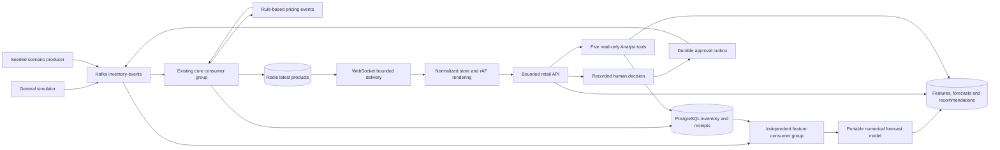

# FlashFlow retail and AI implementation report

Historical upgrade evidence, October 3, 2026. The subsequent [October 4 polish report](final-polish.md) records current presentation, suppression policy, latency fixes and new verification. All sales data is simulated. No remote CI, production deployment, real retail accuracy or live LLM result is claimed. The Analyst is deliberately configured in evidence-only mode, following the selected scope.

## A. What was built

The home page now explains what needs attention instead of only showing changing inventory. Operations ranks products by stockout risk and explains forecasts; Products separates observed history from future predictions and shows actual pricing decisions; Recommendations records human approval/rejection and eventual Kafka execution; AI Analyst answers from bounded backend evidence. Engineering preserves the original four rendering modes, live metrics and failure controls at `/engineering`, with added model health.

Seeded normal, flash-sale, demand-spike and restock scenarios use three dedicated Retail Demo products. Scenario attempts are durable, reproducible plans; stock constraints determine fulfilled sales. Scenarios do not edit React state or bypass the inventory pipeline. The generic throughput simulator remains available and excludes these products.

This is a retail operations prototype, rather than a full shopping/checkout site. Its useful demonstration is a flash sale, rising observed sales, a future sales estimate, an explainable risk/action, human approval, Kafka restock, and an execution receipt. Restocking changes availability immediately after processing; risk may take the next forecast cycle to update and ongoing sales can offset the added stock.

## B. Architecture

The core is still one FastAPI process with configurable co-located inventory/pricing consumer members. The separate `forecast` process observes core-acknowledged inventory events using its own Kafka group and feature receipts, snapshots bounded histories, runs numerical inference, advances scenarios and publishes approved restocks. It can fail or stop without requiring model inference in the inventory handler. PostgreSQL remains authoritative; Redis caches/telemetry are best effort. One advisory worker is supported; active-active advisory execution is not implemented.

New advisory tables store bucket features, feature receipts, immutable forecast output with separately matured actual sales, scenario metadata and recommendation audits. Alembic migrations `0004` and `0005` add these without rebuilding the original inventory tables. The optional training dependency is absent from the runtime image; the model is bounded numeric JSON, not executable pickle.

## C. ML problem definition

Estimate **completed, stock-constrained sales over the next simulated hour**, using the last simulated hour of completed history. This is not latent demand, revenue optimization or a stockout probability. Stockout-censored sales must not be interpreted as lack of demand.

Each five real seconds represents five simulated minutes. Twelve bins form one simulated hour, lasting sixty real seconds. Online inputs stop at a completed bucket; the target begins at the next whole bucket strictly after issuance. This adds at most five seconds of alignment delay and excludes a partial acquisition bucket. Forecasts include input end, issuance and target times. Offline origins use adjacent fully observed windows; this online alignment and acquisition difference limits direct comparison with offline errors.

Features are recent sales lags, three/twelve-bin means, twelve-bin standard deviation, acceleration, available stock, current/base price ratio, time-of-day sine/cosine and current promotion. No future sales, stock, promotion changes or future scenario label enters inference. Cold starts wait for twelve bins rather than fabricate history.

## D. Dataset

The seeded generator produces 24 simulated products over four days, with popularity, daily seasonality, price sensitivity, Poisson purchase attempts, normal/flash/spike regimes, stock limits and periodic restocks. There are **27,072 examples**. The CSV includes attempted demand for censoring inspection but the model trains on fulfilled future sales.

Chronological partitions contain **16,008 training, 5,232 validation and 5,256 test examples**, with 576 origin rows purged so target windows cannot cross the next split. Windows within a split overlap, so errors are correlated. An additional seed/product set has 1,584 examples. Repeating generated regimes are easier than arbitrary unseen retail behavior.

Dataset SHA-256: `76457dadb4af0454d3e1ed0fc525c8a0a957beec0c8b1e2f5c5822aa99f9c4f4`. Raw data and model/evaluation metadata are in `apps/api/artifacts/`; exact commands and the full experiment are in [the ML experiment](ml-experiment.md).

## E. Baseline versus ML

Baseline: mean of the last three sales bins multiplied by twelve. ML: scikit-learn histogram gradient boosting, 100 trees, learning rate 0.08, maximum 15 leaves/depth 5, L2 regularization 2, seed 42 and no early stopping. Runtime evaluates exported numerical trees with the standard library. Portable predictions reproduced the fitted model with a measured maximum delta of zero on the export verification sample.

| Held-out population | Count | Baseline MAE | ML MAE | Baseline RMSE | ML RMSE |
| --- | ---: | ---: | ---: | ---: | ---: |
| Chronological overall | 5,256 | 17.20 | 6.13 | 25.93 | 9.08 |
| Normal | 2,304 | 10.73 | 5.28 | 16.13 | 7.44 |
| Flash sale | 1,152 | 26.03 | 6.64 | 36.34 | 10.06 |
| Demand spike | 1,800 | 19.82 | 6.89 | 28.02 | 10.24 |
| Additional seed/products | 1,584 | 14.06 | 6.85 | 21.58 | 9.53 |

Errors are in fulfilled units per simulated hour. These results establish improvement on this generator, not real-world generalization. See `apps/api/artifacts/evaluation.json` and [independent portable evaluation](benchmarks/ai-portable-evaluation/portable-evaluation.json). Ordinary unit CI does not retrain; the separate manual ML workflow produces evaluation artifacts.

## F. Forecast uncertainty

The 90th percentile of validation absolute residuals is **13.9874 units**. Bounds are prediction ± this radius, with the lower bound clipped at zero. Measured chronological test coverage was **89.65%**. This is an empirical residual band, not a formally guaranteed interval or probability of stockout. Coverage can change with regime shift, censoring and model mismatch. Baseline fallback uses a separately labeled heuristic band.

All forecast numeric fields are finite and validated; bands must be ordered. Artifact loading validates schema, horizon, tree structure and limits. A missing/invalid model selects the moving average and exposes its model version/fallback flag rather than hiding the failure.

## G. Stockout logic

Available stock is stock minus reserved stock. Estimated time to stockout is `60 × available / expected_sales`, assuming a constant average rate and no inbound stock. Zero expected sales yields no finite estimate. Risk is CRITICAL for no available stock or an estimate at most 15 simulated minutes; otherwise HIGH when expected sales reaches available stock; MEDIUM when the upper band reaches available stock; HEALTHY otherwise.

Each card supplies the stock, forecast, band and reason. A forecast older than thirty real seconds, or unavailable data, is labeled stale and cannot safely authorize a fresh action. Stale forecasts do not become healthy by default.

## H. Recommendation logic

For nonhealthy products, proposed quantity is `ceil(upper_bound + safety_stock - available)`, clamped from zero to the configured maximum (defaults: safety stock 10, maximum 500). Healthy products propose zero. The formula, inputs, risk and model version are inspectable; it is a heuristic replenishment recommendation without supplier lead time or cost optimization.

Only fresh PENDING recommendations can be approved/rejected. A row lock resolves concurrent decisions; repeat approval is rejected. Approval records the operator, note, decision timestamp and stable inventory event ID. The worker retries publication with that same ID; the existing core receipt/idempotency path prevents a duplicate stock addition. Publication and execution timestamps are separate, and EXECUTED requires the core receipt. Rejection creates no restock. Old pending recommendations expire and are refreshed rather than silently changing the quantity under an existing approval.

Trusted scenario/operator quantity commands obtain their revision while holding the inventory row lock, avoiding an optimistic snapshot race. Ordinary producers still require a version. This trusts Kafka producer identity/source fields within the local deployment; public untrusted Kafka access would require stronger authentication and ACLs.

## I. AI Analyst

The selected mode is **evidence-only**, requiring no provider or API key. It routes supported questions to five bounded read-only tools: attention products, product details, recommendations, scenarios and system health. Answers include observed numbers, source timestamps, limitations and a visible tool trace. Product context is optional; malformed inputs, missing products and tool errors are explicit. It cannot approve actions or execute arbitrary SQL, URLs, Python or shell commands.

An optional HTTPS-compatible provider adapter is implemented but disabled by `ANALYST_ENABLED=false`. It has a tool whitelist, validated UUID/limit arguments, bounded tool rounds/output, timeout, concurrency limit and numerical grounding checks. Mocked provider success, invented-number rejection, invalid tools and provider failure are tested; **no live provider call was verified**. Keyword evidence routing is intentionally narrower than general conversation, and numerical checks alone do not prove complete prose faithfulness. A public provider mode needs further evaluation and authentication before deployment. Keys stay server-side and are never sent to the browser.

## J. Reliability

- Existing Kafka ordering, core idempotency, PostgreSQL row locks, pricing revisions, Redis fallback, bounded WebSocket queues and React coalescing remain in place.
- Feature receipts and bucket sales update in one transaction before the advisory group commits. Missing core receipts wait/rewind; records definitively passed by the core can be skipped as rejected. Failed first batches rewind fetched offsets even when no own offset has yet been committed.
- Forecasts have causal target timestamps and immutable prediction metadata. Actual sales mature only after the target ends and the feature consumer catches up. Model health separates heartbeat, feature lag/age, successes/failures, fallback count and recent matured MAE/RMSE. Recent online errors may mix versions/regimes and are not held-out test accuracy.
- A real missing-model probe selected the baseline: [raw fallback evidence](benchmarks/model-fallback-2026-10-03.json). Stopping the worker made forecasts stale while the original inventory integration still passed: [isolation evidence](benchmarks/forecast-isolation-2026-10-03.json).
- Core restart replay, invalid-event DLQ, Redis outage replay safety, catalog circuit OPEN/HALF_OPEN/CLOSED recovery and paused freshness checks passed locally. Retail tests verified wrong-token rejection, rejection without mutation, approval/outbox/core receipt, repeat-approval conflict and causal targets.

Controls require development mode, an enable flag and a server-side local token; the frontend proxy enforces same origin/local requests. Ordinary demo fault controls are disabled after testing. This is a local safety boundary, not user identity/RBAC or a public deployment authorization system.

## K. Performance

Measurements are local Docker Desktop results with same-host clocks. They establish behavior at specified loads, not maximum production capacity. Before/after raw pipeline samples use three core consumer members, one socket observer, 500 configured events/sec for sixty seconds and no ordinary simulator traffic. Post-upgrade includes the advisory worker. No browser rendering is measured by this pipeline probe. A final sample and comparison are recorded in [the evidence summary](benchmarks/ai-summary-2026-10-03.json); the earlier post-upgrade pilot is retained separately.

| Pipeline sample | Produced | Actual producer/sec | Drain seconds | Socket P50/P95/P99 ms | Maximum sampled lag | Probe errors |
| --- | ---: | ---: | ---: | --- | ---: | ---: |
| Before retail upgrade | 29,996 | 499.81 | 2.05 | 529.17 / 1,383.75 / 2,020.79 | 857 | 0 |
| Final upgrade, worker active | 29,997 | 499.82 | 2.03 | 393.81 / 804.81 / 936.72 | 346 | 0 |

The final run drained completely; throughput including drain was 483.46 inventory events/sec. The lower final latency is an observation from a short sequential local sample, not evidence of an AI-driven speedup. [Final raw measurement](benchmarks/post-ai-final-2026-10-03.json).

The earlier post-upgrade pilot produced **29,991 events at 499.81/sec**, drained in **2.04 seconds**, reached sampled maximum lag **834**, and measured event-to-client P50/P95/P99 **597.32/1,367.62/1,740.78 ms** with no probe errors. The pre-upgrade sample P95 was **1,383.75 ms**. Short runs do not justify a claim that AI improved core latency.

The two-trial browser rendering experiment used synthetic 500 updates/sec, six measured seconds per trial, 500 mounted cards and the preserved Engineering page. BATCHED mean FPS was **59.06**, mean trial P95 render latency **25.5 ms**, browser CPU **48.92%**. ATOMIC/MEMOIZED mean FPS was 53.63/53.37; NAIVE did not provide a useful FPS sample and measured 99.61% CPU. Trials vary; CPU is browser process measurement, and browser synthetic results are not live event latency. [Raw browser data](benchmarks/browser-1791041382552.json).

The distinct 30-second real HTTP/WebSocket case connected **100/100 clients**, with zero connection errors, **1,500 successful catalog requests**, zero HTTP errors and zero slow-client disconnects. Fanout P95 was **12.63 ms**. It used normal 10/sec traffic plus the bounded retail scenario running during that sample; it was **not** 100 clients at 500/sec. [Raw load data](benchmarks/ai-load-100-2026-10-03.json). Existing historical throughput artifacts remain unchanged.

## L. Tests

Executed locally on the final implementation: **40 backend unit tests, 10 frontend unit tests and 10 browser tests passed; zero failed and zero skipped**. The browser suite includes both mocked retail states and live Kafka/circuit checks. TypeScript validation, production frontend build and fatal Ruff checks passed. The optional model was fitted/evaluated locally; portable evaluation and deterministic dataset reproduction are separate checks.

Live phase-two inventory, pricing, pipeline, restart and resilience probes passed. The retail integration passed a twelve-bin flash sale, normal/spike/restock scenarios, approval/rejection and receipt auditing: [retail evidence](benchmarks/retail-final-integration-2026-10-03.json). The flash run recorded 83 attempts, 60 fulfilled and 23 censored; these counts depend on that run's starting stock and approved restock. A seed reproduces attempts, not fulfillment under a different stock history.

The GitHub workflow definitions were updated with this upgrade; this report records local verification and does not claim a remote workflow pass. The upgrade was subsequently pushed as `08048d5`; the polish report separately states its publishing status. Results and command scope are recorded in the evidence summary; failed intermediate development checks were repaired before the stated final passes.

## M. Limitations

Synthetic data and repeating regimes; censored sales target; accelerated clock; offline/online timing difference; snapshots rather than exact per-event stock/price features; twelve-bin cold starts; heuristic lead-time-free replenishment; no real supplier integration; single advisory worker; no retention/archival policy for advisory tables; trusted internal Kafka commands; local operator label rather than verified identity; no deployed multi-user auth; optional LLM not live-verified; no production performance guarantee. Model monitoring observes degradation but does not auto-retrain or prove causality. The final live health snapshot reported recent matured MAE **44.88** and RMSE **44.95**, substantially worse than the synthetic held-out result. These 200 rolling forecasts span the local mixed engineering/scenario workload, with different stock ranges and acquisition timing; they demonstrate that offline accuracy does not transfer automatically. The observed last 500-product forecast batch took **408.02 ms**; this is one telemetry snapshot, not an inference percentile benchmark. [Final health evidence](benchmarks/retail-final-health-2026-10-03.json).

Adding a cart/payment/storefront now would dilute the existing engineering and operations demonstration. A stronger next step is real historical data with permissions, realistic replenishment lead times and sustained mixed-load evaluation, followed by authenticated multi-user operation if the project becomes a hosted application.

## N. Demo script

Follow the 3–5 minute demo (local reference): introduce the clock and business question, trigger a seeded Retail Demo flash sale, inspect observed history versus forecast/band, explain the stockout calculation, ask the evidence Analyst why the product needs attention, approve a recommendation, show publication/execution receipt, and finish at Engineering with core and model health. Warm up the history before presenting; restock availability may be needed if earlier tests exhausted the demo product.

## O. Interview explanation

The five-minute technical walkthrough (local reference) follows the actual inventory event, database receipt, Redis snapshot, socket and browser path before adding the independent causal forecast observer. It explains why forecasting cannot delay inventory processing, how approval reuses the existing idempotent event path, and why a numerical forecast model and an evidence Analyst solve different problems.

## P. Interview questions

Twenty-two implementation-specific questions and answers (local reference) cover Kafka ordering/offsets, PostgreSQL transactions, Redis fallback, WebSocket backpressure, React coalescing, forecasting targets, leakage, feature design, baseline choice, intervals, stockout assumptions, monitoring, grounded tool calls, failure isolation and human approval.

## Q. Resume bullets

- Built an event-driven retail operations prototype with audited human-approved Kafka restocks; a final local 60-second worker-enabled probe produced 29,997 events at 499.82/sec and drained in 2.03 seconds.
- Trained a synthetic-sales gradient boosting model that reduced chronological held-out MAE from 17.20 to 6.13 across 5,256 examples, with 89.65% test coverage for a validation-calibrated 90% residual band.
- Preserved React micro-batching at 59.06 mean FPS in a two-trial synthetic 500-update/sec browser experiment, and verified 100 simultaneous local socket connections with 1,500 successful catalog requests and no connection/HTTP errors in a separate 30-second load case.
- Implemented read-only evidence tools, forecast fallback and audited approval controls; validated 60 local unit/browser tests plus live restart, circuit recovery, forecast isolation and scenario probes.

These bullets explicitly describe local/synthetic measurements. They must not be rewritten as real business impact or deployed customer scale.
