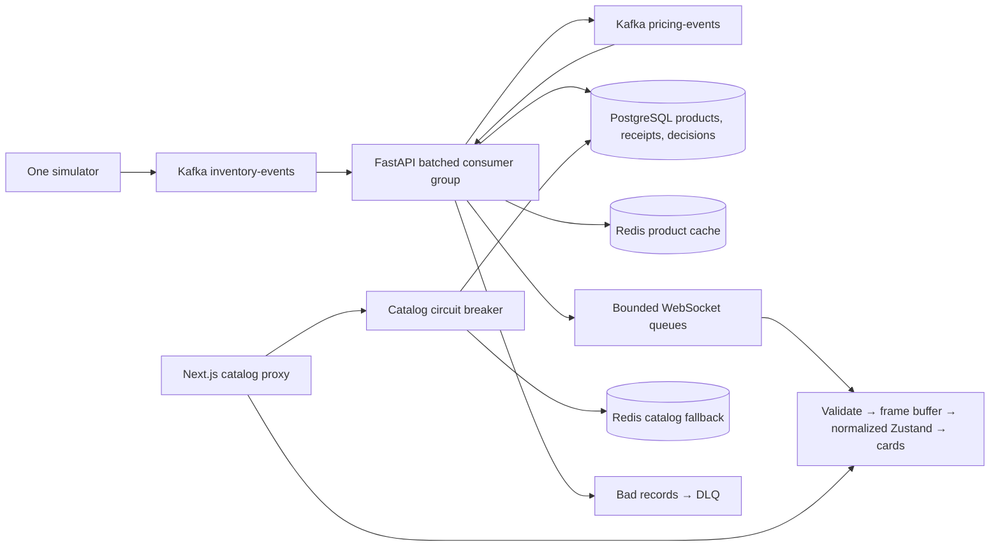
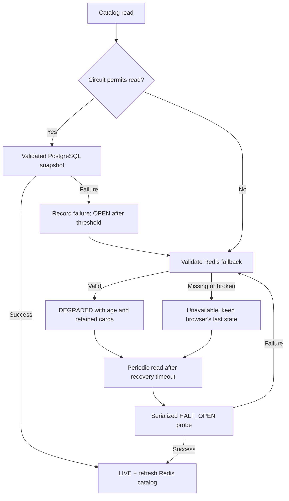

# Architecture and operating boundaries

This is a single FastAPI process with inventory/pricing handlers and a WebSocket connection manager, not three separately deployed services. Next.js serves the dashboard and fixed server-side proxies. Docker Compose runs Kafka, PostgreSQL, Redis, the API, frontend, and one simulator and configurable co-located Kafka group members.



## Event and price sequence

```mermaid
sequenceDiagram
  participant S as Simulator
  participant K as Kafka
  participant C as Consumer
  participant D as PostgreSQL
  participant R as Redis
  participant B as Browser
  S->>K: Product-keyed inventory envelope
  K->>C: Manual-commit record
  C->>D: Sorted product locks; ordered transitions; receipts + stock + decisions in one batch transaction
  D-->>C: Transaction committed
  C->>K: Publish pending audited pricing decision
  C->>R: Repair/write current product
  C->>B: Enqueue product snapshot with event/emission timestamps
  C->>K: Commit successful contiguous batch offset
  K->>C: Pricing envelope references durable decision
  C->>D: Recheck bounds/time/revision; apply once or audit rejection
  C->>R: Price snapshot, separate price_version
  C->>B: Price-only update through same path
  C->>K: Commit pricing offset
```

Kafka ordering is per partition/topic, not across inventory and pricing topics. The database row lock, durable decision ID, pending-decision ownership, and independent revisions enforce correctness across those streams. An inventory producer cannot bypass the audited price path. Source offsets are retained on infrastructure errors; bad records go to the DLQ only after acknowledged publication.

WebSocket enqueue is not browser acknowledgement. Slow queues (100 entries) close with 1013; snapshots on reconnect repair missed delivery. Redis product keys support repair, while full-catalog fallback is refreshed only by successful catalog reads. PostgreSQL is authoritative for stock/prices; stale cached cards must never authorize checkout.

## Failure and recovery



Injected read latency/failures do not destroy containers or stop database event writes. Redis-bound processing holds the affected member until replay repairs delivery. Pauses must remain below Kafka's five-minute poll interval; a terminal consumer failure needs restart. Fault and circuit state are process-local. Redis has no persistent volume.

## Metrics semantics

`/metrics` is process-local, reset on restart, and sampled every roughly two seconds. Kafka records/s is records fetched by this consumer across both topics, not configured simulator rate or broker ingress. Pricing records/s includes retries across restarts/duplicate records, not necessarily applied changes. Processed/duplicate/stale are successful outcomes; failed counts attempts, not unique failed events. DLQ increments only after publication acknowledgement. Fanout sends count successful product `send_json` calls across all connected clients, excluding heartbeats; they do not prove client rendering. Slow-client disconnects are counted separately.

Consumer lag sums broker end offsets minus committed group offsets over all co-located workers' assigned partitions. It includes in-flight fetched work. Per-topic lag and sample timestamps are returned; unavailable/unassigned measurements are null, not zero. Assignments from every co-located group member are aggregated. External consumer processes are excluded; those need an admin/exporter whole-group gauge.

Redis cache-hit rate means validated **full-catalog fallback hits / fallback attempts**. Normal live database reads and write-only product caches are not cache hits. No fallback attempts means N/A. Browser FPS is animation-frame frequency, commits are actual card layout effects, receipt latency uses a monotonic browser clock, and event latency uses source UTC timestamp to card commit. P50/P95/P99 use the latest 512 rendered samples; coalesced-away events are excluded. Different hosts need synchronized clocks. Missing/negative timestamps are excluded, not clamped into good-looking results. Periodic snapshots can advance cards without socket latency samples.

API CPU is process CPU time / wall time (100% = one core). Peak RSS is Linux `ru_maxrss`, not current working set or all-container memory. Browser CPU is Chromium renderer TaskDuration from CDP, not total browser/system CPU; JS heap excludes DOM/native allocations. Measurements from these definitions are not interchangeable.

## Scaling and deployment plan (not implemented)

1. Measure bottlenecks and establish a controlled latency/lag budget before scaling. Increase Kafka partitions and consumer instances while preserving product keys, row locking, idempotent receipts, schema compatibility, and revision guards. New key/partition mappings need a controlled ordering migration.
2. Decouple consumers from gateways. Each consumer group divides partitions; it does not deliver every update to every gateway. Publish processed snapshots to a shared fanout channel (Redis pub/sub or another broker). Gateways keep bounded local queues, and clients retain snapshot repair because pub/sub is not durable.
3. Put TLS WebSocket-capable load balancing in front of gateways, configure heartbeat/idle timeouts and draining. An established socket naturally stays on its chosen backend; do not add sticky routing unless session state needs it. Replace hard-coded port 8000 with deployment-aware routing.
4. Use managed Kafka/PostgreSQL/Redis, migrations as a deployment job rather than competing startup workers, least-privilege accounts, secret management, backups, audit retention, and tested restore. Add pending-outbox reconciliation if publication no longer runs in the source-record retry path.
5. Add user authentication, authorization, origin checks for public sockets, request/connection limits, bounded HTTP timeouts, readiness checks, and network isolation. Fault controls must stay disabled. The provided Compose credentials and loopback ports are local defaults, not deployment credentials.
6. Export process/group/gateway metrics to Prometheus/Grafana and distributed traces using event IDs; add schema registry/compatibility enforcement when independently deployed producers require it. Run controlled multi-host tests and failure drills before claiming production availability.

The current deployment is intentionally local, with one API worker and one simulator and configurable co-located Kafka group members. Audit/receipt tables grow indefinitely, pricing is rule-based rather than trained ML, and the 500-card grid is not virtualized. There is no checkout/payment system or multi-node failover guarantee.
