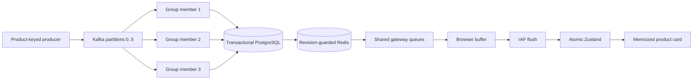

# Pipeline timing and correctness

Inventory batches (up to `CONSUMER_BATCH_SIZE` per partition) lock product rows in sorted ID order, preload receipt IDs with one query, apply transitions in Kafka order, and persist every receipt and pricing decision in one transaction. A bad batch rolls back; individual handling isolates invalid records and acknowledges their DLQ publication before advancing offsets. Pending pricing publication is queried once per batch. Audits remain transactional: moving them without independent outbox reconciliation would weaken correctness.

Redis uses an atomic Lua revision guard: an older stock or price revision cannot overwrite a newer entry from another topic/group member. Socket delivery uses bounded per-client queues and independent send tasks, with configurable send timeouts. Overflow closes only that client (1013); durable Kafka/database records are never dropped. Reconnect repairs visual delivery with a snapshot.

Offsets commit once per successful contiguous partition batch, after durable commit, required pricing publication, Redis repair and socket enqueue. Crashes before offset acknowledgement can replay a whole batch. Receipts and pricing decision IDs make business effects idempotent; socket delivery can repeat. This is at-least-once delivery with effectively-once business processing, not Kafka exactly-once.

Shutdown stops polling, finishes bounded fetched work, commits successful batches and closes dependencies. After the grace timeout cancellation can roll back SQL or leave durable work unacknowledged for replay. A revoked partition is not acknowledged after work; its new owner resumes from committed offsets. Unit checks simulate revocation, and live integration checks exercise database redelivery and restart. A multi-host destructive rebalance drill remains unmeasured.

`CONSUMER_INSTANCES` starts real Kafka clients in the same group/process, capped by configured inventory partition count. Each member processes assigned partition records sequentially. Keys remain product IDs; cross-topic pricing concurrency uses row locks and independent revisions. Increasing partitions changes key mapping and requires a drained migration; topic initialization does not silently resize existing topics.



## Clock and metric definitions

Backend stage windows retain at most 4,096 observations per stage, with cumulative count/total time and nearest-rank P50/P95/P99. Local durations use `perf_counter`; cross-process intervals use UTC. Percentiles from different stages must not be added.

| Stage | Definition |
| --- | --- |
| Producer acknowledgement | Harness enqueue to acknowledged send; overlaps producer/broker intervals |
| producer_to_consumer | Source creation to `getmany` return; includes producer, broker, fetch/network and Kafka client buffering |
| producer_to_broker | Producer enqueue to broker LogAppendTime; absent for CreateTime records |
| broker_to_consumer | Broker LogAppendTime to `getmany` return; includes residence, fetch/network and client prefetch |
| consumer_queue_wait | `getmany` return to dispatch of a partition batch |
| database_batch | Whole inventory batch transaction, including lock wait and commit |
| database_amortized | Batch transaction time / record count; batch-weighted statistic, not individual transaction latency |
| database | Individual pricing or invalid-batch fallback transaction |
| pricing_publish_batch | Pending-outbox query, required Kafka acknowledgement and published-marker commit |
| processing_batch | Full batch critical path, excluding offset commit |
| processing | Batch dispatch to an individual record's enqueue; includes earlier work in that batch |
| redis | Atomic cache revision check/write |
| offset_commit | Kafka group commit request/acknowledgement |
| websocket_enqueue | Enqueue loop over all currently connected clients |
| websocket_queue | Enqueue to individual sender dispatch |
| websocket_send | Awaited socket JSON send; excludes client acknowledgement |
| socketTransport | Individual send timestamp to browser receipt; requires aligned UTC clocks |
| browserQueue | Browser receipt to rAF/store flush, using `performance.now` |
| render | Store flush to card layout commit, using `performance.now` |
| Event to UI | Source creation to card layout commit, UTC clocks, latest 512 rendered samples |

Events carry creation, optional producer enqueue, fetch, processing and per-client socket-send timestamps without storing those trace fields in PostgreSQL. The browser keeps bounded receipt/flush/commit samples separately. Only the exact socket product object that renders is sampled; periodic snapshot advances and coalesced-away events are excluded. Layout commit precedes paint; physical display scanout is not measured.

Broker intervals require topic `message.timestamp.type=LogAppendTime` (record timestamp type 1). CreateTime cannot reveal broker append time; those stages remain unavailable. Kafka timestamps have millisecond precision. Clock skew/quantization can yield negative cross-process intervals, which are excluded rather than clamped. This is lightweight stage instrumentation, not a complete distributed trace of broker internal disk/network operations.

Broker inventory ingress uses end-offset deltas. Completed inventory rate is separate from all-topic completions. Committed lag includes fetched/in-flight records and deferred commits. Metrics aggregate co-located group assignments; external processes require group-wide exporter/admin telemetry. Current RSS uses Linux procfs; peak RSS and API process CPU are separate gauges. Benchmark generators run beside the API and create contention. Simulator and benchmark producers must never overlap.

Keep database mutation, receipts, pricing audits/outbox and required publication in the critical path. WebSocket sends are already asynchronous; only bounded enqueue runs there. Metrics use bounded memory. Redis was a small share of the serial baseline, so no speculative cache pipeline or asynchronous audit service was added.

## Enable broker append clocks on existing local topics

New topics created by Compose use `KAFKA_TIMESTAMP_TYPE=LogAppendTime`. For an existing drained local stack, apply the topic configuration explicitly:

```powershell
docker compose stop simulator
docker compose exec -T kafka /opt/kafka/bin/kafka-configs.sh --bootstrap-server kafka:9092 --entity-type topics --entity-name inventory-events --alter --add-config message.timestamp.type=LogAppendTime
docker compose exec -T kafka /opt/kafka/bin/kafka-configs.sh --bootstrap-server kafka:9092 --entity-type topics --entity-name pricing-events --alter --add-config message.timestamp.type=LogAppendTime
```

This changes future broker record timestamps, not business event creation timestamps or partition mapping. Existing CreateTime records retain their prior timestamp type. The producer's Redis telemetry expires after five seconds; simulator target is N/A when no recent telemetry exists. Broker ingress remains independently measured. Optional telemetry writes have a 0.2-second socket timeout; failure does not stop durable production.

## Browser/container clock alignment

Raw browser event-to-UI uses client UTC directly and remains available for comparison. The additional clock-aligned gauges estimate server-minus-browser offset from each `/metrics` response's `server_now` and the midpoint of the browser request interval. They expose the offset and RTT/2 uncertainty, reject requests slower than two seconds and expire the estimate after 15 seconds. Aligned rendered samples retain a separate latest-512 window. This is an approximate HTTP clock calibration with asymmetric-path bias, not NTP or a guarantee of sub-millisecond synchronization. Browser-local queue/flush/commit durations remain monotonic and do not require calibration. Synthetic fixtures have no server clock and keep their historical raw metric definition.
